# 🛡️ Awesome Financial Crime Intelligence



<p align="center">
  <a href="https://github.com/ishandutta2007/Awesome-Awesome-Awesome"></a><a href="https://discord.gg/jc4xtF58Ve"></a>
  <a href="https://github.com/ishandutta2007/Awesome-Financial-Crime-Intelligence/stargazers"></a>
  <a href="https://github.com/ishandutta2007/Awesome-Financial-Crime-Intelligence/network/members"></a>
  <a href="https://github.com/ishandutta2007/Awesome-Financial-Crime-Intelligence/blob/main/LICENSE"></a>
  <a href="https://github.com/ishandutta2007"></a>
</p>

---

## 📌 Executive Summary & Overview

Welcome to **Awesome Financial Crime Intelligence**, a curated index of top-tier **SaaS platforms**, enterprise technologies, and **open-source GitHub projects** designed for **Financial Crime Intelligence (FinCrime)**, **Anti-Money Laundering (AML)**, **Sanctions Screening**, **Transaction Monitoring**, **Know Your Customer (KYC)**, and **Entity Resolution**.

These solutions empower banks, payment processors, fintechs, and regulated financial institutions to detect money laundering schemes, complex fraud rings, trade-based money laundering (TBML), sanctions evasion, and terrorist financing through real-time transaction scoring, graph analytics, and automated Suspicious Activity Report (SAR) generation.

> [!NOTE]
> **Last Updated**: September 2026. Contributions are welcome! Please see the [Contribution Guidelines](#-how-to-contribute) to submit new platforms or open-source tools.

---

## 📑 Table of Contents

- [🏢 SaaS & Hosted Enterprise Platforms](#-saas--hosted-enterprise-platforms)
- [🔓 Open-Source GitHub Projects](#-open-source-github-projects)
- [🧱 Architectural Blueprint & System Design](#-architectural-blueprint--system-design)
- [🤝 How to Contribute](#-how-to-contribute)
- [⚠️ Compliance & Legal Disclaimer](#%EF%B8%8F-compliance--legal-disclaimer)
- [💖 Support & Community](#-support--community)
- [📈 Star History](#-star-history)

---

## 🏢 SaaS & Hosted Enterprise Platforms

> 📊 **Sector Market Size & Dynamics**: The global Financial Crime & Anti-Money Laundering (AML) software market is estimated at **$28.4 Billion in 2025** and projected to reach **$55.8 Billion by 2030** (CAGR ~14.5%). The sector is **moderately fragmented**, comprising established legacy enterprise compliance suites alongside high-growth AI-native unicorns and specialized compliance point solutions.

| 🏢 Platform | 💡 Key Capabilities & Description | 📊 Company Size / Valuation / Revenue | 💵 Pricing (Starting Tier / Enterprise) | 🎁 Free Tier / Free Trial Limits |
| :--- | :--- | :--- | :--- | :--- |
| **[Oracle FCCM](https://www.oracle.com/)** | Comprehensive enterprise financial crime & compliance management platform offering transaction monitoring, case management, and regulatory SAR reporting inside Oracle cloud ecosystem. | **~$400B+ Market Cap**<br/>*(Oracle Corp / $53B+ ARR)* | **$100,000 / year**<br/>*(Starting enterprise base license)* | **30-Day Free Trial**<br/>*(Oracle Cloud Sandbox with $300 free credits)* |
| **[SAS AML](https://www.sas.com/)** | Enterprise analytics-driven AML, behavioral monitoring, and fraud detection platform providing robust risk scoring and examiner-ready compliance audit trails. | **~$3.2B Annual Revenue**<br/>*(Private Enterprise Leader)* | **$75,000 / year**<br/>*(Starting module licensing)* | **14-Day Free Trial**<br/>*(SAS Viya Sandbox for up to 5 active users)* |
| **[NICE Actimize](https://www.niceactimize.com/)** | Global leader in autonomous financial crime management, covering end-to-end AML, sanctions screening, market surveillance, and fraud prevention. | **~$10B Market Cap**<br/>*(NICE Ltd / ~$2.4B Revenue)* | **$85,000 / year**<br/>*(Starting core module subscription)* | **30-Day Guided Sandbox**<br/>*(Enterprise sandbox demo upon compliance vetting)* |
| **[Quantexa](https://www.quantexa.com/)** | Decision Intelligence platform leveraging advanced entity resolution and network graph analytics to unveil hidden criminal networks and shell companies. | **$2.2B Valuation**<br/>*(Unicorn - Series E)* | **$60,000 / year**<br/>*(Starting tier for entity resolution)* | **14-Day Private Sandbox**<br/>*(Limited to 50k graph nodes / 10k entities)* |
| **[Feedzai](https://www.feedzai.com/)** | AI-native RiskOps suite unifying real-time fraud detection, AML transaction monitoring, and customer risk scoring for payment networks & banks. | **$1.5B Valuation**<br/>*(Unicorn - Series D)* | **$50,000 / year**<br/>*(Starting platform tier)* | **14-Day Sandbox Trial**<br/>*(Limited to 10,000 real-time test transactions)* |
| **[Featurespace](https://www.featurespace.com/)** | Adaptive behavioral analytics platform (ARIC) delivering real-time fraud and AML transaction scoring with industry-leading false-positive reduction. | **$925M Valuation**<br/>*(Acquired by Visa in 2024)* | **$45,000 / year**<br/>*(Starting enterprise deployment)* | **30-Day Sandbox Trial**<br/>*(Simulated transaction stream testing environment)* |
| **[ComplyAdvantage](https://complyadvantage.com/)** | AI-driven financial crime risk intelligence, offering real-time PEP screening, adverse media monitoring, and sanctions watchlist updates via REST APIs. | **$800M Valuation**<br/>*(Series C / ~$50M+ ARR)* | **$1,200 / month**<br/>*($14,400/yr starting tier)* | **14-Day Free API Trial**<br/>*(Includes 100 free sanctions/PEP API lookup calls)* |
| **[ThetaRay](https://www.thetaray.com/)** | AI-powered transaction monitoring platform utilizing un-supervised anomaly detection to flag cross-border payment risks and money laundering networks. | **$500M Valuation**<br/>*(Series C / ~$30M+ ARR)* | **$30,000 / year**<br/>*(Starting SaaS package)* | **14-Day Sandbox Access**<br/>*(Limited to 25,000 sandbox transaction records)* |
| **[DataWalk](https://datawalk.com/)** | Enterprise graph-based investigative analytics software designed to accelerate multi-layered financial crime investigations and link analysis. | **$150M Market Cap**<br/>*(Publicly Traded - GPW: DAT)* | **$25,000 / year**<br/>*(Starting tier per analyst node)* | **14-Day Desktop/Cloud Sandbox**<br/>*(Limited to 100,000 graph nodes)* |
| **[AMLYZE](https://amlyze.com/)** | Specialized SaaS AML solution providing real-time transaction monitoring, sanctions screening, and customer risk scoring for fintechs & neobanks. | **$25M Valuation**<br/>*(Seed / Series A / ~$2M+ ARR)* | **€499 / month**<br/>*(~$6,500/yr up to 5,000 tx/mo)* | **14-Day Free Trial**<br/>*(Full feature access up to 1,000 sandbox transactions)* |

---

## 🔓 Open-Source GitHub Projects

The open-source ecosystem provides transparent, auditable algorithms for record linkage, watchlist matching, synthetic data generation, and transaction scoring.

> [!TIP]
> Each open-source repository below is sorted in **descending order by GitHub star count** and features a direct link to its stargazers page.

1. **[dedupe](https://github.com/dedupeio/dedupe)** <a href="https://github.com/dedupeio/dedupe/stargazers"></a>  
   *Python library for accurate and scalable fuzzy matching, record deduplication, and entity resolution in compliance & customer master datasets.*

2. **[Zingg](https://github.com/zinggAI/zingg)** <a href="https://github.com/zinggAI/zingg/stargazers"></a>  
   *Open-source identity and entity resolution engine using machine learning for enterprise financial data pipelines and identity graph building.*

3. **[OpenSanctions](https://github.com/opensanctions/opensanctions)** <a href="https://github.com/opensanctions/opensanctions/stargazers"></a>  
   *Open database & ETL pipeline aggregating global sanctions lists, Politically Exposed Persons (PEPs), and regulatory watchlists into standardized entity formats.*

4. **[Moov Watchman](https://github.com/moov-io/watchman)** <a href="https://github.com/moov-io/watchman/stargazers"></a>  
   *High-performance Go service for search and automated screening of OFAC, EU, UN, and international sanctions/watchlist databases.*

5. **[IBM AMLSim](https://github.com/IBM/AMLSim)** <a href="https://github.com/IBM/AMLSim/stargazers"></a>  
   *Multi-agent synthetic banking transaction simulator generating complex money laundering patterns for benchmarking ML models and graph algorithms.*

6. **[Jube](https://github.com/jube-home/aml-fraud-transaction-monitoring)** <a href="https://github.com/jube-home/aml-fraud-transaction-monitoring/stargazers"></a>  
   *Open-source platform (AGPLv3) for real-time transaction monitoring, hybrid rule + machine learning detection, case management, and audit trails.*

7. **[GNN AML Detection](https://github.com/issacchan26/AntiMoneyLaunderingDetectionWithGNN)** <a href="https://github.com/issacchan26/AntiMoneyLaunderingDetectionWithGNN/stargazers"></a>  
   *Graph Attention Network (GAT) framework for detecting suspicious financial transaction flows and collusive money laundering rings.*

8. **[AI AML System](https://github.com/mominalix/AI-Based-Anti-Money-Laundering-AML-System)** <a href="https://github.com/mominalix/AI-Based-Anti-Money-Laundering-AML-System/stargazers"></a>  
   *Microservices-based AML compliance engine combining rule heuristics, machine learning anomaly scoring, and automated SAR report generation.*

9. **[Awesome Financial Crime](https://github.com/SKR-35/Awesome-Financial-Crime)** <a href="https://github.com/SKR-35/Awesome-Financial-Crime/stargazers"></a>  
   *Curated repository of datasets, compliance guides, and open tools for financial crime investigation and KYC surveillance.*

10. **[Osprey](https://github.com/opensource-finance/osprey)** <a href="https://github.com/opensource-finance/osprey/stargazers"></a>  
    *Lightweight transaction monitoring engine in Go using Common Expression Language (CEL) rules and FATF typologies for quick deployment.*

---

## 🧱 Architectural Blueprint & System Design

Building an end-to-end financial crime intelligence stack involves orchestrating transaction ingestion, entity resolution, behavioral scoring, and alert management:

```
[ Financial Transactions / Wire Payments ]
                  │
                  ▼
   [ Stream Ingestion Engine (Kafka/Flink) ]
                  │
                  ├──► [ Entity Resolution & Record Linkage ] (Zingg / Dedupe)
                  │
                  ├──► [ Watchlist & Sanctions Screening ] (Moov Watchman / OpenSanctions)
                  │
                  ├──► [ Real-Time Rule & ML Scoring ] (Jube / Osprey / Custom Models)
                  │
                  └──► [ Graph Analytics & Mule Ring Detection ] (Neo4j / NetworkX)
                                    │
                                    ▼
                 [ Investigator Alert & SAR Case Management ]
```

---

## 🤝 How to Contribute

We welcome contributions from compliance practitioners, data scientists, and software engineers!

1. **Fork** this repository on GitHub.
2. Check out a new branch: `git checkout -b feature/add-new-tool`.
3. Add your entry to either the **SaaS** table or **Open-Source** list following the established Markdown table/list format.
4. Ensure all pricing, company valuation, and star count details are factual and verifiable.
5. Open a **Pull Request** with a detailed explanation of your proposed addition.

Explore curated awesome collections on [Awesome-Awesome-Awesome](https://github.com/ishandutta2007/Awesome-Awesome-Awesome).

---

## ⚠️ Compliance & Legal Disclaimer

- This repository is a **community-curated informational index** — it is not exhaustive and does not constitute endorsement.
- Financial crime technologies support regulatory obligations under laws such as the **Bank Secrecy Act (BSA)**, **USA PATRIOT Act**, **EU AML Directives**, and **FATF Recommendations**.
- Open-source tools are **not** a plug-and-play replacement for enterprise compliance frameworks or certified transaction surveillance systems.
- Always consult qualified compliance officers and legal counsel before implementing financial monitoring logic.

---

## 💖 Support & Community

Thank you for exploring **Awesome Financial Crime Intelligence**! If you find this repository valuable, please consider supporting its development:

- ⭐ **Star** this repository to help compliance engineers & researchers discover open resources.
- 🔀 **Fork** & contribute to keep our platform comparisons and star metrics fresh.
- 📢 **Share** with your peer network on LinkedIn, Twitter/X, and Fintech communities.
- ☕ **Sponsor Development**: Support ongoing maintenance via [GitHub Sponsors](https://github.com/sponsors/ishandutta2007).

---

## 📈 Star History

[](https://star-history.dera.page/#ishandutta2007/Awesome-Financial-Crime-Intelligence&type=date&legend=top-left)

---

<p align="center">
  <sub>Maintained with ❤️ for Financial Crime, AML, and Compliance Technology Teams globally.</sub>
</p>
